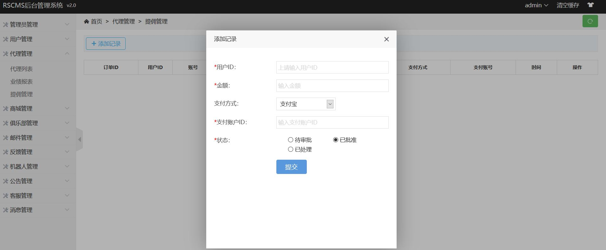
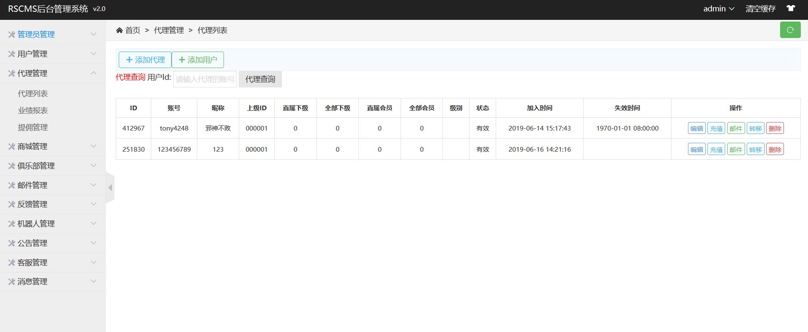
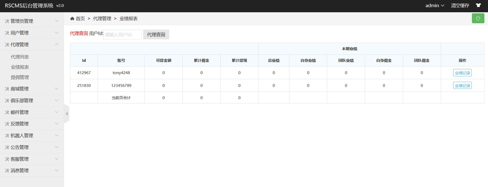
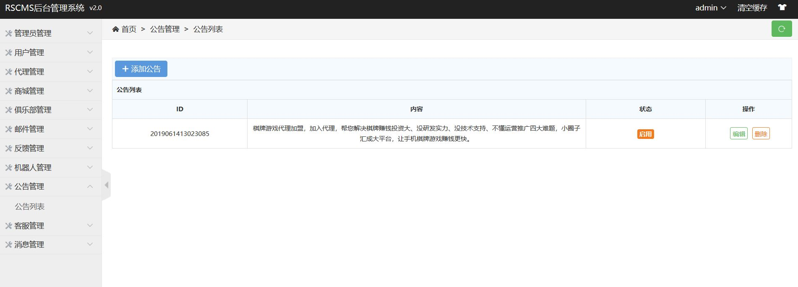
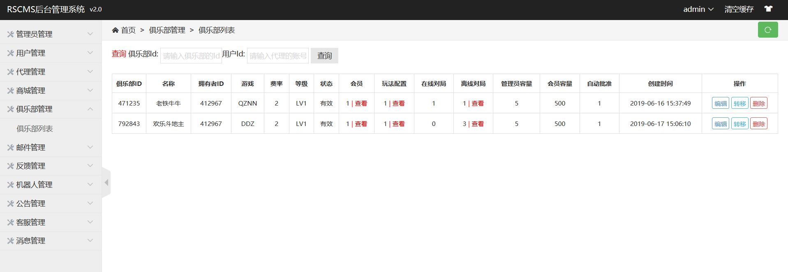
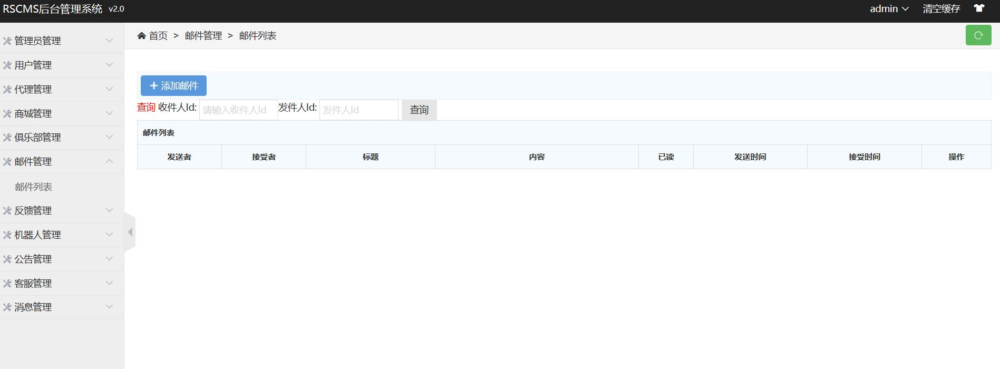
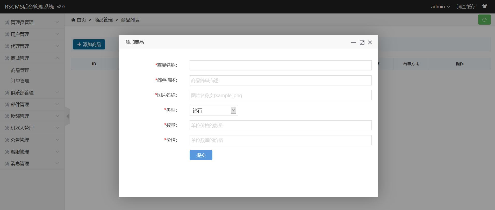
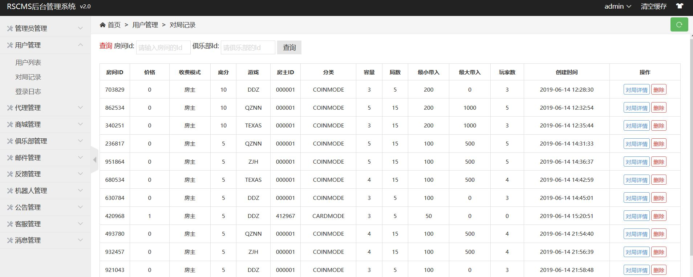
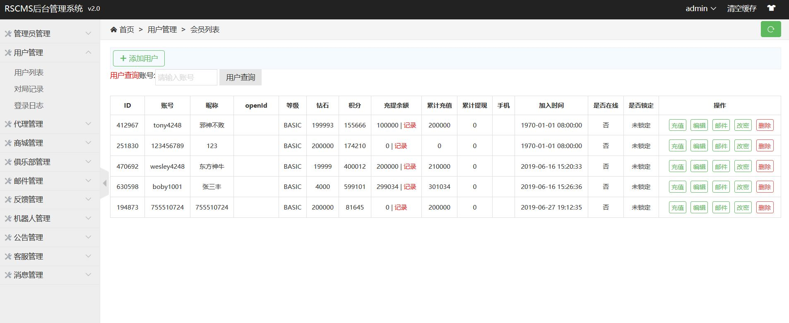
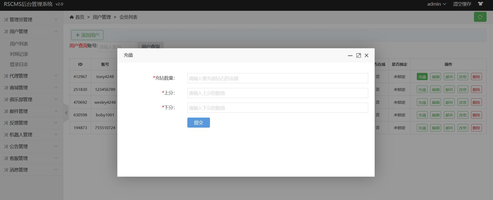

RedShark棋牌游戏管理后台
=====
RedShark的平台的管理后台,完成对游戏平台的日常运行运行管理,报表分析的功能。包括无限级的代理分销管理,俱乐部管理。

## 重要的功能:
* 管理员管理:增加、修改管理员及其权限，记录管理员登陆日志
* 用户管理:增加、修改用户,用户编辑,充值,兑换,对局统计,邮件,登陆日志
* 代理管理:增加、修改代理,代理业绩报表，提佣管理
* 商城管理:增加、修改商品，充值,兑换
* 俱乐部管理:增加、修改俱乐部,俱乐部有独立的积分体系
* 机器人管理:投放、修改机器人
* 邮件管理:查看,回复邮件
* 公告管理:发布,取消公告
* 反馈管理:查看,回复反馈
* 滚动消息管理:发布,修改滚动消息

## Demo:
* 正在寻找环境

## 功能截屏

## 依赖的平台
* ThinkPHP
* MongoDB

## 授权
	Copyright (C) 2017 QQ:1248756778
	This code is licensed under The General Public License version 3
	
## 反馈
	Your feedbacks are highly appreciated! :)
